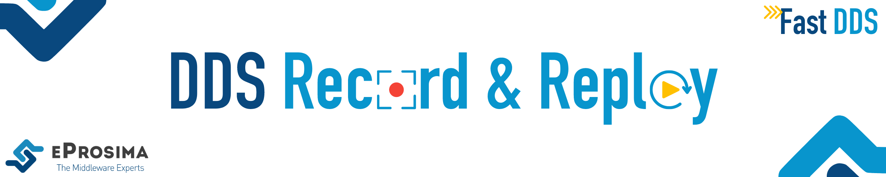

 

    <strong>
        <a href="https://eprosima.com/index.php/downloads-all">Download</a>
        &nbsp;&nbsp;•&nbsp;&nbsp;
        <a href="https://dds-recorder.readthedocs.io/en/latest/">Docs</a>
        &nbsp;&nbsp;•&nbsp;&nbsp;
        <a href="https://eprosima.com/index.php/company-all/news">News</a>
        &nbsp;&nbsp;•&nbsp;&nbsp;
        <a href="https://x.com/EProsima">X</a>
        &nbsp;&nbsp;•&nbsp;&nbsp;
        <a href="mailto:info@eprosima.com">Contact Us</a>
    </strong>

  

    
    
    
    
    
     
    
    
    

  

*eProsima DDS Record & Replay* is an end-user software application that efficiently saves DDS data published in a DDS environment into a MCAP format database.
Thus, the exact playback of the recorded network events is possible as the data is linked to the timestamp at which the original data was published.

*eProsima DDS Record & Replay* is easily configurable and installed with a default setup, so that DDS topics, data types and entities are automatically discovered without the need to specify the types of data recorded.
This is because the recording tool exploits the DynamicTypes functionality of [eProsima Fast DDS](https://fast-dds.docs.eprosima.com), the C++ implementation of the [DDS (Data Distribution Service) Specification](https://www.omg.org/spec/DDS/About-DDS/) defined by the [Object Management Group (OMG)](https://www.omg.org/).

## Documentation

You can access the documentation online, which is hosted on [Read the Docs](https://dds-recorder.readthedocs.io/).

* [Introduction](https://dds-recorder.readthedocs.io/en/latest/)

**Recording application**

* [Getting Started](https://dds-recorder.readthedocs.io/en/latest/rst/recording/getting_started/getting_started.html)
* [Usage](https://dds-recorder.readthedocs.io/en/latest/rst/recording/usage/usage.html)
* [Configuration](https://dds-recorder.readthedocs.io/en/latest/rst/recording/usage/configuration.html)

**Replay application**

* [Getting Started](https://dds-recorder.readthedocs.io/en/latest/rst/replaying/getting_started/getting_started.html)
* [Usage](https://dds-recorder.readthedocs.io/en/latest/rst/replaying/usage/usage.html)
* [Configuration](https://dds-recorder.readthedocs.io/en/latest/rst/replaying/usage/configuration.html)

## Getting Help

If you need support you can reach us by mail at `support@eProsima.com` or by phone at `+34 91 804 34 48`.
