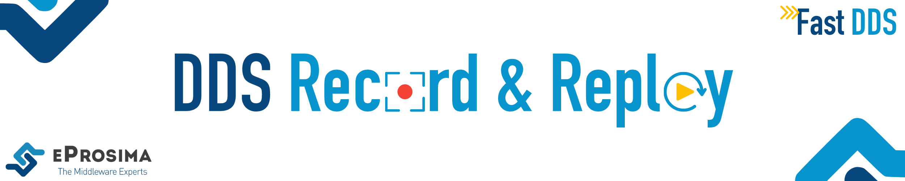

 

    <strong>
        <a href="https://eprosima.com/index.php/downloads-all">Download</a>
        &nbsp;&nbsp;•&nbsp;&nbsp;
        <a href="https://dds-recorder.readthedocs.io/en/latest/">Docs</a>
        &nbsp;&nbsp;•&nbsp;&nbsp;
        <a href="https://eprosima.com/index.php/company-all/news">News</a>
        &nbsp;&nbsp;•&nbsp;&nbsp;
        <a href="https://x.com/EProsima">X</a>
        &nbsp;&nbsp;•&nbsp;&nbsp;
        <a href="mailto:info@eprosima.com">Contact Us</a>
    </strong>

  

    
    
    
    
    
     
    
    
    

  

*eProsima DDS Record & Replay* records live DDS traffic into MCAP and/or SQLite and publishes it again later with its recorded timing.
It includes DDS Recorder, DDS Replayer, the optional graphical Remote Controller, and the `mcap-convert` utility.

DDS Pipe provides the shared discovery, filtering, QoS, transport, and payload-routing core used by the tools.
Recorder uses the DynamicTypes functionality of [eProsima Fast DDS](https://fast-dds.docs.eprosima.com) to store type information when it is available.

## Commercial support

Looking for commercial support? Write us to info@eprosima.com

Find more about us at [eProsima’s webpage](https://eprosima.com/).

## Documentation

You can access the documentation online, which is hosted on [Read the Docs](https://dds-recorder.readthedocs.io/).

* [Overview](https://dds-recorder.readthedocs.io/en/latest/)
* [Record and replay in five minutes](https://dds-recorder.readthedocs.io/en/latest/rst/workflows/record-replay.html)
* [Use DDS Recorder](https://dds-recorder.readthedocs.io/en/latest/rst/recording/usage/usage.html)
* [Use DDS Replayer](https://dds-recorder.readthedocs.io/en/latest/rst/replaying/usage/usage.html)
* [Recording files and formats](https://dds-recorder.readthedocs.io/en/latest/rst/formats/file-formats.html)
* [Common DDS configuration](https://dds-recorder.readthedocs.io/en/latest/rst/configuration/common.html)
* [Troubleshooting](https://dds-recorder.readthedocs.io/en/latest/rst/troubleshooting/troubleshooting.html)
